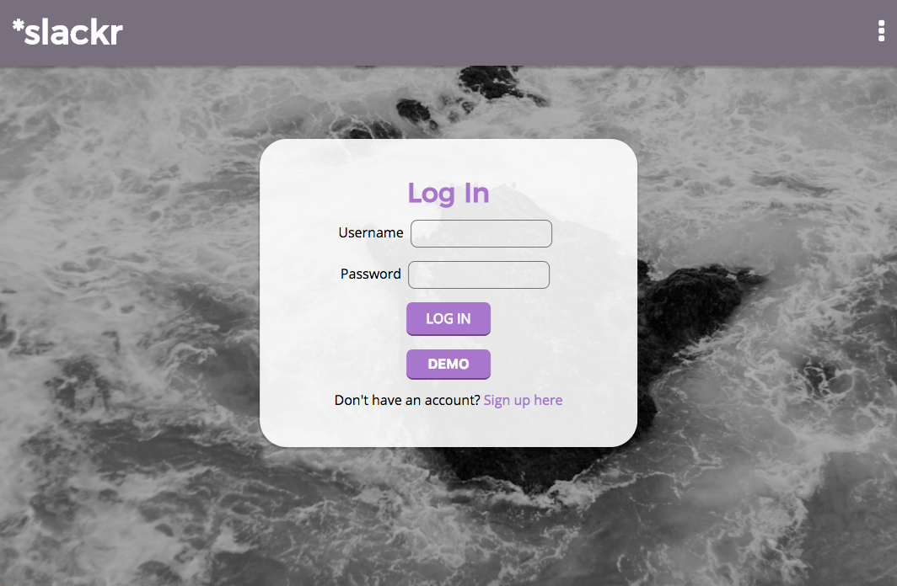
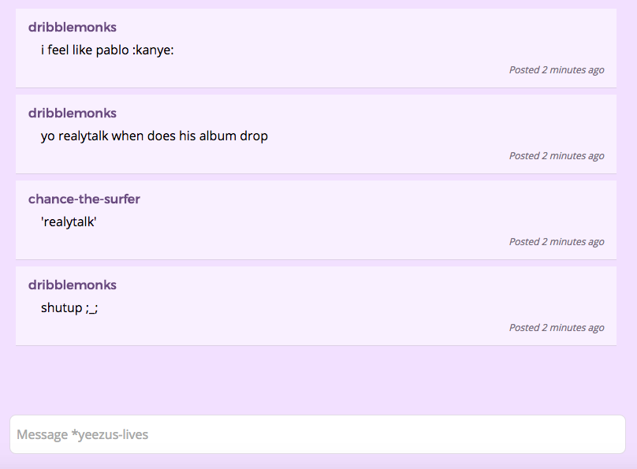
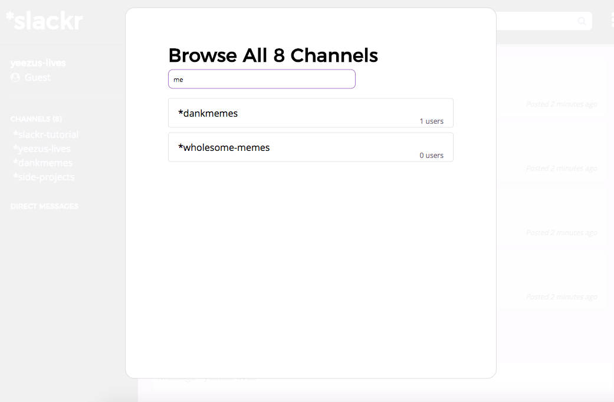
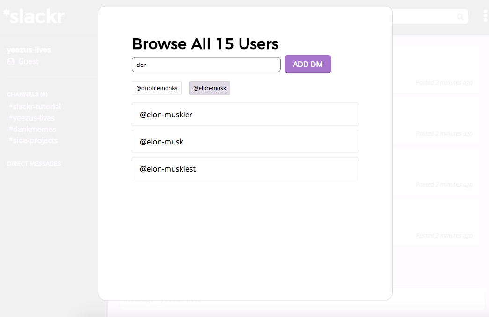

# \*slackr

[\*slackr](http://www.slackr.space) is a team messaging app for teams who want to do anything but work. It is built on a Rails backend using React and Redux to handle dynamic frontend rendering.

## Features and Implementation

### Secure User Authentication


Users who sign up for \*slackr can be assured that their passwords are protected, with passwords being stored a hashed digest using Rail's BCrypt gem, which is based on the Blowfish cipher, a cipher which to date has no effective cryptanalysis. It incorporates a salt to protect against rainbow table attacks and has a base iteration of ten rounds of hashing to protect against brute force measures.

New visitors can easily preview all of \*slackr's functionality without signing up for their own account. Clicking on the Demo button logs a visitor in to a built-in Guest account, leading them to the tutorial channel. Guest data is cleared every 24 hours, so if users want their data to persist they should sign up for an actual account.

### Live Chat


Messages are stored in the database and belong to both an `author` and either a `channel` or a `direct_message`. ActionCable, introduced in Rails v5.0, is used to upgrade a user's connection to a websocket to allow users to send a receive messages in real time.

### Channels


Messages are organized primarily through channels, which any user can freely join or leave as they please. Channels can be dynamically searched and filtered through in the Channel Search bar which updates on every keystroke entered into it.

### Direct Messages


Users can also message one or more other users using \*slackr's Direct Message feature. Simply select the users you want to message from the list and message away! Add a user you didn't mean to? No worries, with \*slackr it's as simple as clicking on their name below the search bar to make them go away and never speak of them again. With as many users as \*slackr has, searching is a breeze thanks to a similar functionality with its above-described Channel Search.

### Giphy

\*slackr supports the use of Giphy's Translate API endpoint to allow users to type in `/giphy [text]` to insert an animated GIF matching their description into the conversation. The giphy data is stored as a specialized string in the database and is parsed on the frontend via the use of Regular Expressions:

```js
//chat_element.jsx
let giphyMatch = body.match(/GIPHY_DATA (.+) _ (.+) _ (.+)/);
if(giphyMatch) {
  return (
    <div className='giphy'>
      <a href={giphyMatch[1]}>{giphyMatch[2]}</a><br />
      <p>Posted using /giphy [text]</p>
      
    </div>
  );
}
```

### Emojis

\*slackr supports the full range of Twitter's emoji library, based on the Unicode Version 9.0 library of emojis decided by The Unicode Consortium. Emojis can either be entered in with their shortname (`:smile:`) or in some cases with an ASCII representation (`:)`). Alternatively, Users can select emojis from the full range via the Emoji Selector button on the far right of the Message Entry input. Selecting an emoji will insert it into the user's text input and close the Emoji Selector menu. Emojis are stored in the database with shortnames or ASCII characters and are parsed on the frontend thanks to the `react-emoji` library.

### Links

\*slackr lets users post clickable links to other sites. A Regular Expression is used to determine if a User's message is a link, and then parses that data via another Expression to determine if the link address is complete or not in order to construct an `<a>` tag with the appropriate parameters:

```js
//chat_element.jsx
let linkMatch = body.match(/^((https?:\/\/)?([\da-z\.-]+)\.([a-z\.]{2,6})([\/\w \.-]*)*\/?)(.*)$/);
if(linkMatch) {
  const https = linkMatch[1].match(/^http/) ? "" : "https://";
  return (
    <div>
      <a href={`${https}${linkMatch[1]}`}>
        {ReactEmoji.emojify(linkMatch[0])}
      </a>
    </div>
  );
}
```

### Single Page Application

\*slackr is a true single page application with minimal routing to ensure a clean and intuitive user experience. Users will never have to manually enter a URL, and after a user logs in they stay on the same page for the entire duration of their session. This is accomplished using React's virtual DOM which only updates components that have changed based on data in Rails' database.

### Easter Eggs!

Like any good app, \*slackr has a few secrets to share, for those inclined to find them ;)

## Future Development

\*slackr is at its base still a MVP application. Here are a few previews of what to expect in future builds of \*slackr:

### Notifications

\*slackr plans to notify users when they have unread messages in a channel they are not currently active in.

### Memes

What's the point of a chat application about goofing off without memes? \*slackr agrees and plans to integrate an API similar to Giphy that will post one of the top memes randomly selected from reddit's me_irl page.
